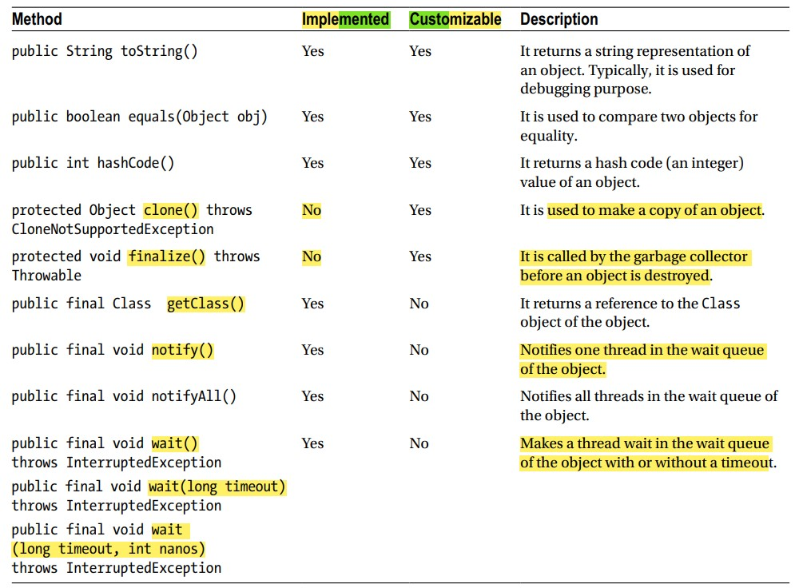

# Object

## Introduction
- Available in `java.lang` package,
- `Superclass` of all classes,
- All java classes extends this `Object` class indirectly,

## 2 important rules of Object class:
- `(Rule-1:)`A variable of `Object` class can hold a reference of an object of any class. Because
  - `Object` class is the superclass of all classes,
  - Since variable of superclass can hold object of its subclasses. So,
  - A variable of `Object` class can hold a reference of an object of any class,
  - Ex: See `Test.java`,
    ```
    private static void ruleTest1(){
    
        Object myObj = new Object();
    
        String name = "hello";
        Object nameObj = name; // ok
    
        Object name2 = "hello"; // ok
        System.out.println(name2); // hello
    
    
        Exception exception = new Exception("anything");
        Object ex = exception; // ok
    }
    ```
- `(Rule-2:)` The Object class has `9` methods, which are available to be used in all classes in Java
  - We can put the methods into two categories:
  - Category - 1:
    - Can't override these methods,
    - Implementation is final,
    - Methods are: 
      - `getClass()`, 
      - `notify()`, 
      - `notifyAll()`, 
      - `wait()`
  - Category - 2:
    - Have a default implementation in the Object class,
    - Can override these methods,
    - Methods are:
      - `toString()`,
      - `equals()`, 
      - `hashCode()`, 
      - `clone()`, 
      - `finalize()`
  - Details of methods
  
  - `Implemented` means method have default implementation,
  - `Customizable` means method can be overridden,

## getClass() method
- Returns the reference of the Class object,
- Ex: See `Test.java`,
  ```
  private static void testGetClass(){
      Cat cat = new Cat("Cat");
      Class<?> catClass = cat.getClass();
  
      System.out.println(catClass); // class g_TheObjectClass.Cat
  
      System.out.println(catClass.getName()); // g_TheObjectClass.Cat
  
      System.out.println(catClass.getSimpleName()); // Cat
  }
  ```

## Hash code
- Learn `Hashing` or ignore it, since it is already implemented & you may never override it, 
- By using an `algo`, form a `piece of info`, an `integer value` is generated(`hashing`),
- Every object has a `hash-value`,
- Used for efficiently retrieving data from hash based collections like `Hashtable`, `HashMap` etc,
- The Object class has a `hashCode()` method that returns an `int`, which is the hash code of the object,
- `hashCode()` is already implemented, but you can override it,(`no need to override`),
- Rules when you override the hashCode() method in your class:
  - Suppose you have `2` variables `x`, `y` referring object of your class,
  - If `x.equals(y)` returns `true`, then
    - Hash of `x` and `y` must be same. i.e.,
    - `x.hashCode() = y.hashCode()`,
  - Opposite of above is not true. i.e. if `x.hashCode() = y.hashCode()` then `x.equals(y)` may not be true,
  - `hashCode()` should generate same value if it is called on same object,
  - Use only those instance variables to compute hash code for an object, which are also used in `equals()` method to check for equality,
- See 