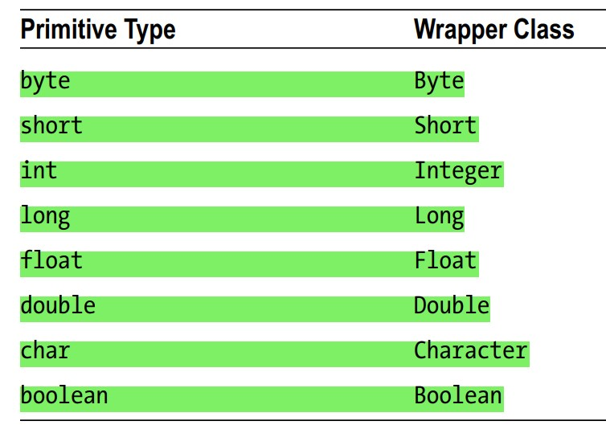

# Wrapper class

## Introduction
- primitive and reference types are not assignment compatible, i.e. can't assign primitive data into reference or vice-versa,

## Wrapper class
- Wrapper class provides a way to use/convert primitive data as object,
- Java provided `8` classes to represent each of the `8` primitive types,
- These classes are called wrapper classes as they wrap a primitive value in an object,
- 
- All wrapper classes are immutable,
- They provide two ways to create their objects:
  - Using constructors,
  - Using the valueOf() factory methods,
  - Ex:
      ```
    Integer num1 = new Integer(120);
    Integer num2 = Integer.valueOf(120);
    Integer num3 = 120; // Boxing. Later
    ```
- `valueOf()` is preferred over constructors as this method caches some objects for reuse,
- The new operator always creates a new object but,
- `valueOf()` caches wrapper objects for primitive values between -128 and 127,
  ```
  Integer n1 = Integer.valueOf(20);
  Integer n2 = Integer.valueOf(20);
  System.out.println(n1 == n2); // true

  Integer n3 = Integer.valueOf(1240);
  Integer n4 = Integer.valueOf(1240);
  System.out.println(n3 == n4); // false
  ```

## Numeric wrapper class
- `Byte`, `Short`, `Integer`, `Long`, `Float`, and `Double` classes are numeric wrapper classes,
- Inherited from the `Number` class,
- They wrap six primitive numeric data type,

## Character Wrapper Class
- An object of the `Character` class wraps a char value,

## Boolean Wrapper Class
- An object of the `Boolean` class wraps a boolean,

## Autoboxing and Unboxing
- ### Autoboxing
  - primitive to Wrapper,
  - Automatic wrapping from a primitive data type to its corresponding wrapper object,

- ### Unboxing
  - Wrapper to primitive,
  - Unwrapping from wrapper object to its corresponding primitive data type, is called unboxing.
- Ex:
    ```
    Integer n = 200; // Boxing or AutoBoxing
    int a = n; // Unboxing
    ```
- Every primitive can be converted into object, But opposite is not true. why?
- Remember reference variable can be `null` and there is no value for `null` in primitive type, so `NullPointerException` is thrown,
- Ex:
    ```
    Integer num4 = null;
    int num5 = num4; // error
    ```
- ### Overloaded method
  - Nothing special, think normally,
  - Ex:
    ```
    private static void printNumber(Integer num){
        System.out.println("Integer -> "+num); 
    }
    
    private static void printNumber(int num){
        System.out.println("int -> "+num);
    }
    ```
  - Calling like:
    ```
    printNumber(1002); // int -> 1002
    Integer val = 1002;
    
    printNumber(val); // Integer -> 1002
    ```
  - > No need to overload. It will work without overloading
  - For comparison operator, values are unboxed then operation is performed. So no problem but,
  - For `==` operator,
    - If both operands are primitive types, they are compared as primitive types using a value comparison,
    - If both operands are reference types, their references are compared, 
    - In these two cases, no autoboxing/unboxing takes place,
    - 

