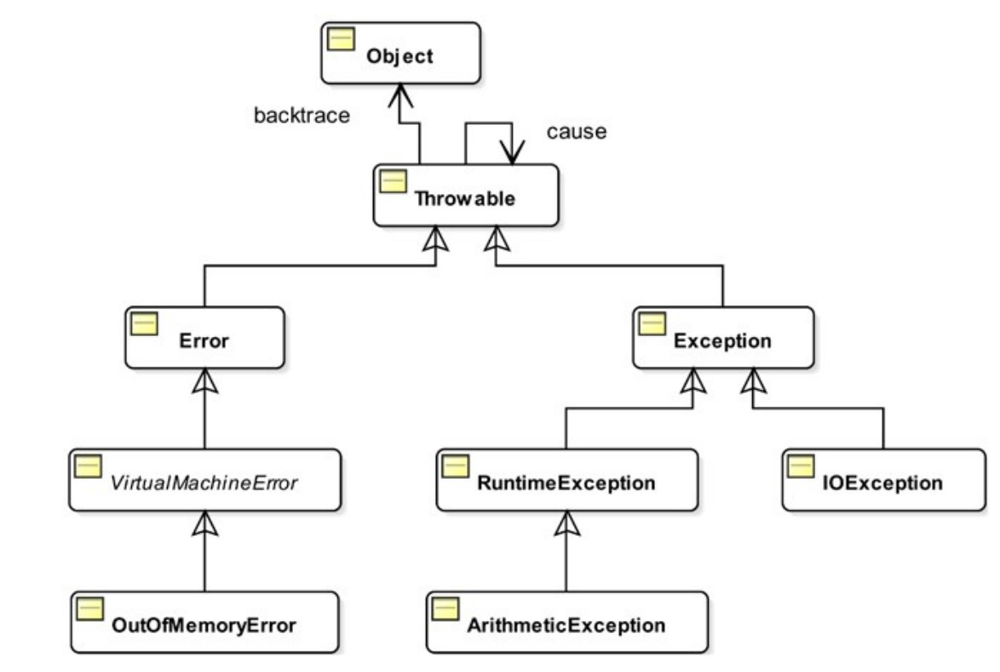
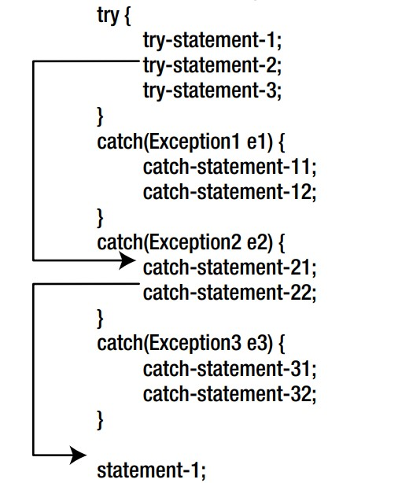

# Exception handling part-1
> Codes are in `partOne` package

## Exception
- A condition that may arise during the execution when a normal path of execution is not defined,
- Ex: See `firstTest()` in `Test.java`
    ```
    private static void firstTest(int y){
        int x = 10;
        int result = (x/y); // will throw exception if y == 0
        System.out.println(result);
    }
    ```
- In above example, 3rd line inside method won't be executed because `2nd line break normal execution`, since integer can't be divided b zero(`0`),
- Above example can be written using `if-else`, but it will make code complex if there are many such condition,
- Equivalence `if-else` code(See `firstTestBadSolution()` in `Test.java`):
    ```
    private static void firstTestBadSolution(int y){
        int x = 10;
    
        if(y == 0){
            System.out.println("Can't divide"); // Can't divide
        }
        else{
            int result = x/y;
            System.out.println(result);
        }
    }
    ```
- Solution to above problem(See `firstTestSolution()` in `Test.java`): 
    ```
    private static void firstTestSolution(int y){
        int x = 10;
        try {
            int result = x/y;
            System.out.println(result);
        }
        catch (ArithmeticException e){
            System.out.println("Can't divide"); // executed when y = 0
        }
    }
    ```
- Structure:
    ```
    try {
         // code that may cause error
    }
    catch(Exception e){ -------------(c)
     // catch all types of exception
    }
    ```
- All the types of exception are `class`. For example `Exception` in `(c)` is a class in java,
- Hierarchy:
- 
- `catch(Throwable t){}` i.e. parameter of catch must be of `Throwable` or any of its subclass. Remember, object of parent class can refer object of its subclass,

## Multiple class block
- We can have multiple catch block,
- Multiple catch blocks for a try block must be arranged from the most specific exception type to the most generic exception type. Otherwise, a compile-time error occurs,
- Ex: (Compile time error) because `ArithmeticException` is child of `RuntimeException`,
    ```
    private static void catchExceptionOrder(int y, String message, String filePath){
        try{
        ...
        ...
        ...
        }
        catch (IOException e) {...}
        catch (RuntimeException e){...}
        catch (ArithmeticException e){...}
    }
    ```
- Valid code: (See `catchExceptionOrder(int,String,String)` in `Test.java`)
    ```
    private static void catchExceptionOrder(int y, String message, String filePath){
        try{
            ...
            ...
            ... 
        }
        catch (IOException e) {...}
        catch (ArithmeticException e){...}
        catch (RuntimeException e){...}
    }
    ```
- Multiple catch block can also be written like this: See `catchMultipleException()` in `Test.java`,
  ```
  private static void catchMultipleException(int y, String message, String filePath){
      try {
          ...
      }
      catch ( RuntimeException | IOException e){ // < -- - -- - --
          System.out.println("Something went wrong");
      }
  }
  ```

## Transfer of control in `try-catch`:
- 
- Only one catch block will be executed based on the type of exception thrown,
- JVM will check each catch block from the first, as soon as it finds a catch block that can handle this exception, that block will be executed,


## Unchecked exception
- Compiler does not check if they are handled in the code,
- May or may not be handled by you, compiler doesn't show error,
- Lower possibility of occurrence,
- Ex: (see `exception_hierarchy.jpg`)
    - The Error class and its subclasses,
    - The RuntimeException class all its subclasses
- In previous example `IOException` must be handled if code inside try block can throw IOException,

## Checked exception
- Compiler checks if they are handled in the code,
- Must be handled i.e. must have corresponding catch block, otherwise compile time error,
- Higher possibility of occurrence,
- Ex: (see `exception_hierarchy.jpg`) 
  - The `Throwable` class,
  - The `Exception` class, 
  - Subclasses of the `Exception` class, except `RuntimeException class and its subclasses`,
- In previous example: catch block for `ArithmeticException` & `RuntimeException` is optional,

## Handling Checked Exception 
- Can be handled in two ways,
  - Using catch block(previous one),
  - Adding in method signature,
- Two ways are shown: See `handleChecked1()` & `handleChecked2()` in `Test.java`,
    ```
    private static void handleChecked1(String filePath){
        try {
            FileReader fileReader = new FileReader(filePath);
            printFile(fileReader);
            fileReader.close();
        }catch (IOException e){
            System.out.println("Failed to read");
        }
    }
    ```
  ```
    private static void handleChecked2(String filePath) throws IOException{
        FileReader fileReader = new FileReader(filePath);
        printFile(fileReader);
        fileReader.close();
    }
    ```
- Can be called using: See `callHandleChecked()` in `Test.java`,
    ```
    private static void callHandleChecked(){
        handleChecked1("invalid");
    
        try {
            handleChecked2("invalid");
        }catch (IOException e){
            System.out.println("Failed to read");
        }
    }
    ```
- What did you learn? You must handle checked exception:
  - Either inside method using try-catch or,
  - While calling method(somewhere in call stack) using try-catch,

## Throwing an Exception
- You can also throw exception if you want,
- Ex: See `throwMyException()` in `Test.java`,
    ```
    private static void throwMyException(int age) throws Exception{
        if(age < 18) throw new Exception("You are baccha");
    
        System.out.println("fine");
    }
    ```
    Can be called like: See `testThrow()` in `Test.java`,
    ```
    try {
        throwMyException(20); // fine
    }catch (Exception e){
        System.out.println(e.getMessage());
    }
    ```
  ```
    try {
        throwMyException(12);
    }catch (Exception e){
        System.out.println(e.getMessage()); // You are baccha
    }
    ```

## Creating own Exception class
- Custom exception class can be created by inheriting/extending existing class,
- Ex: See (`MyException.java`, `MyMessage.java` and `testMyException()` in `Test.java`) 
  ```
  private static void testMyException(MyMessage myMessage) throws MyException{
      if(myMessage.getMessage() == null){
          throw new MyException(myMessage);
      }
      System.out.println(myMessage.getMessage()+" "+myMessage.getMessageId());
  }
  ```

## finally block
- Gets executed no matter how the code in the try and catch blocks,
- Ex: See `finallyTest()` in `Test.java`,
    ```
    private static void finallyTest(String filePath){
        FileReader fileReader = null;
        try {
            ...
        }catch (IOException e){...}
        finally {
            if(fileReader != null){
                try {
                    fileReader.close();
                    System.out.println("finally executed");
                }catch (IOException e){e.printStackTrace();}
            }
        }
    }
    ```
