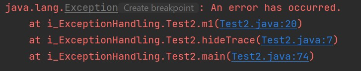
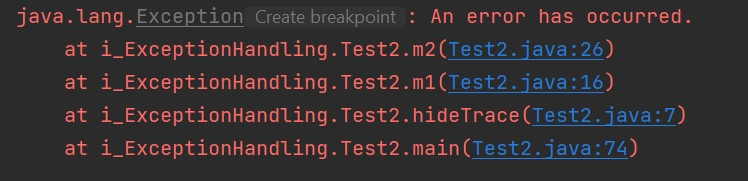

# Exception part-2

## Rethrowing an Exception
- Can be rethrown i.e. can be thrown from `catch` block,
- Can be used for
  - Propagating exception to calling method,
  - Wrapping exception into another exception,
  - Hiding exception details from client,
- Structure:
    ```
    try {
     ...
    }
    catch(MyException e) {
     throw e; // Rethrowing the same exception
    }
    ```
- Rethrown exceptions must be caught from another outer `try-catch` block,
- Ex: (see `Test2.java`)
  ```
  private static void rethrowException(int y){
      try{
          ...
      }catch (Exception e){
          throw new RuntimeException("Can't divide by zero");
      }
  }
  ```
  When calling
  ```
  try {
      rethrowException(0);
  }catch (Exception e){
      e.printStackTrace(); // executed
  }
  ```
- It can also be handled like this:
  ```
  try { // outer, will catch rethrown exception
      try { // innner
          ...
      } catch (Exception e) {
          throw new RuntimeException("Can't divide by zero too");
      }
  }catch (Exception e){
      e.printStackTrace(); // executed
  }
  ```
- Location of exception can also be hidden by using `fillInStackTrace()` method,
- Ex: see `Test2.java`:
  ```
  public static void hideTrace() {
      try {
          m1();
      }
      catch(Exception e) {
          e.printStackTrace(); // hidden original trace
      }
  }
  ```
  ```  
  public static void m1() throws Exception {
      try {
          m2();
      }
      catch(Exception e) {
          e.fillInStackTrace(); // hide trace here -----(a)
          throw e; // rethrowing
      }
  }
  ```
  ```
  public static void m2() throws Exception {
      throw new Exception("An error has occurred."); // just throw
  }
  ```
  - Stack trace with `(a)`:
    - 
  - Stack trace without `(a)`:
  - 
  - Practice yourself to understand clearly,
  

## Throwing too Many Exceptions
- Can be thrown as many as exception you want,
- Ex:
  ```
  private static void throwMultiple(Integer y) throws RuntimeException{
      if(y == null) throw new NullPointerException("Can't be null");
  
      if(y == 0) throw new ArithmeticException("Can't be zero");
  
      System.out.println("ok");
  }
  ```


## Accessing the Stack of a Thread
- Each thread is allocated a stack to store its temporary data,
- A thread stores the state of a method invocation onto its stack,
- When a method is called, it is pushed into the stack,
- When method execution is completed, it is popped from stack,
- Suppose we call a method `m1()` from `main()` then,
  - Stack content (from `m1()`) will be 
    - `m1()` on top,
    - `main()` on bottom
  - Stack content (from `main()`) will be
    - `main()` on top
    - Because `m1()` is completed and popped from stack,
- For getting stack content at any given time, we can create an object of the `Throwable` class (or any `Exception` class), it captures the stack of the thread that is executing,
  ```
  Throwable t = new Throwable();
  StackTraceElement[] frames = t.getStackTrace(); // will return current stack content
  ```
- See `StackFrameTest.java` for more,


## The try-with-resources Block
- For closing object of any resources such as `File`,
- It can be done using `finally` also,
- Structure
  ```
  try (AnyResource aRes = create the resource...) {
   // Work with the aRes here
  }
  ```
- A resource that you specify in a try-with-resources must be of the type java.lang.AutoCloseable,
- When the program exits the try-with-resources block, the `close()` method of all the resources is called automatically,
- Equivalent code using finally
  ```
  AnyResource aRes;
  try {
    aRes = create the resource...;
  }
  finally {
    try {
     if (aRes != null) aRes.close();
    }
    catch(Exception e) {
      e.printStackTrace();
    }
  }
  ```
- So, `try-with-resource` make code simpler,
