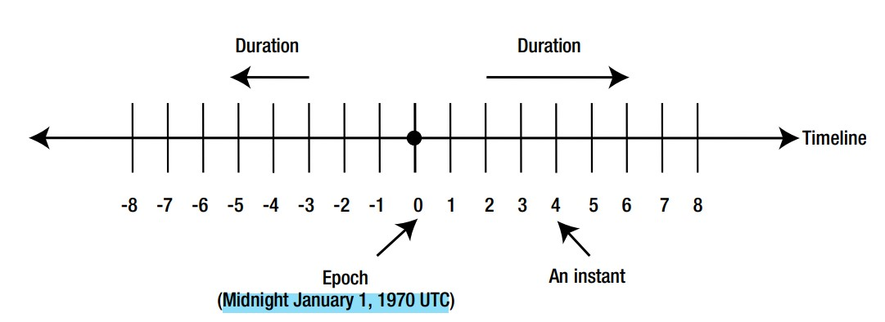

# DateTime part-2

> Codes are in `partTwo` package


## Instants and Durations


- `Epoch` is the reference point. which is `Midnight January 1, 1970 UTC`,
- An `Instant` is a specific point,
- `Duration` is range from `epoch`,
- `nanosecond` precision is available,
- `.toString()`:
  - Returns `yyyy-MM-ddTHH:mm:ss.SSSSSSSSSZ` for `Instant`,
  - Returns `PTnHnMnS` for `Duration`,
- Used for recording `timestamps` and `elapsed time` `between two events`,
- Can be compared to check which one is earlier,
- Classes in the Date-Time API are `Serializable`,
- Ex(`Instant`):
  ```
  Instant instant = Instant.now();
  Instant instant1 = Instant.ofEpochSecond(86420); //second
  
  //----------------------epoch is 1970-01-01T00:00:00Z
  System.out.println(instant1); // 1970-01-02T00:00:20Z
  
  System.out.println( instant1.getEpochSecond() ); // 86420
  System.out.println( instant1.get(ChronoField.MILLI_OF_SECOND) ); // 0
  ```
- Ex(`Duration`):
  ```
  Duration duration = Duration.ofSeconds(86400);
  System.out.println(duration); // PT24H   < ------ 24hours
  
  Duration duration1 = Duration.ofDays(10).plusHours(12).plusMinutes(24).plusSeconds(48);
  System.out.println(duration1); // PT252H24M48S <-- 252hours 24min 48sec
  
  System.out.println( duration1.getSeconds() ); // 908688
  System.out.println( duration1.get(ChronoUnit.NANOS) ); // 0
  ```
- Ex(compare):
- 
