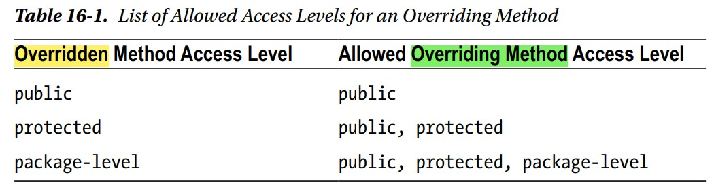

# inheritance part-3

> Codes are in `partThree` package

## Method Overriding
- Redefining a method in child class,
- Ex: See `Parent.java`, `Child.java` & `basicOverriding()` in `Test.java`,
    ```
    public class Parent {
    
        public void walk(){ // overridden method
            System.out.println("Parent walking...");
        }
    
    }
    ```
    ```
    public class Child extends Parent{
    
        @Override // optional annotation
        public void walk(){ // overriding method
            System.out.println("Child walking...");
        }
    
    }
    ```
    Using like this:
    ```
    private static void basicOverriding(){
        Child child = new Child();
        child.walk(); // Child walking...
    
        Parent parent = new Parent();
        parent.walk(); // Parent walking...
    
        parent = child;
        parent.walk(); // Child walking... because of late-binding
    }
    ```

## Overriding rules
### Rule-1:
- Method must have to be an `instance` method,
- Overriding doesn't apply to static methods,
### Rule-2:
- The `overriding-method` must have the same name as the `overridden-method`,
### Rule-3:
- The `overriding-method` must have the same number of parameters 
  - of the same type,
  - in the same order as the `overridden-method`,
  - `void print(String str)` & `void print(String msg)` are considered the same method,

### Rule-4:
- For primitive data type,
  - `return-type` of both methods must be the same,
- For reference data type,
  - `return-type` of the `overriding-method` must be assignment compatible to the `return-type` of the `overridden-method`, i.e.,
  - `Child-type` should be assignment compatible to `Parent-type`,
- Ex:
  ```
  public class Parent {
      ...
      int getOne(){ return 1; }
      Parent getThis(){ return this; }
      ...
  }
  ```
  ```
  public class Child extends Parent{
      ...
      @Override
      int getOne(){ return -1; }
      @Override
      Child getThis(){ return this; }
      ...
  }
  ```
  Using like this: See `overridingRule4()` in `Test.java`,
  ```
  private static void overridingRule4(){
      Parent parent = new Parent();
      System.out.println(parent.getOne()); // 1
  
      parent = new Child();
      System.out.println(parent.getThis()); // Child
  }
  ```

### Rule-5:
- The access level of the `overriding-method` must be at least the `same or more relaxed` than that of the `overridden-method`,
- `private` members can't be overridden since they are not inherited,
- See this:
- 


### Rule-6:
- The `overriding-method` can't add a new exception to the list of exceptions in the `overridden-method`,`(a)`
- It may remove one or all exceptions, `(b)`
- It may replace an exception with another exception, But exception must be child of `overridden-method` exception, `(c)`
- Ex: See `CheckedException1.java`, `CheckedException2.java`, `CheckedException11.java`, `Father.java`, `Son.java`, 
  ```
  public class CheckedException1 extends Exception{ }
  ```
  ```
  public class CheckedException2 extends Exception{ }
  ```
  ```
  public class CheckedException11 extends CheckedException1{ }
  ```
  ```
  public class Father {
      public void calc(int x) throws CheckedException1, IOException {
          System.out.println("Father");
          if(x == -1) throw new CheckedException1();
          if(x == 0) throw new IOException();
      }
  }
  ```
  ```
  public class Son extends Father{
  
  //    @Override
  //    public void calc(int x) throws CheckedException11, IOException {//fine (c)
  //        System.out.println("Son");
  //    }
  
  
  //    @Override
  //    public void calc(int x) throws CheckedException2{ // error <------(a)
  //        System.out.println("Son");
  //    }
  
  
  //    @Override
  //    public void calc(int x) throws CheckedException1{ // valid (b)
  //        System.out.println("Son");
  //    }
  
      @Override
      public void calc(int x){ // valid (b)
          System.out.println("Son");
      }
  }
  ```

## Overriding summary
- CF things 
  - Name of the method: `same`,
  - Number of parameters: `same`,
  - Type of parameters: `same`,
  - Order of parameters: `same`,
  - Return type: `same` or `child` of `overridden-method` `return-type`,
  - Access level: `same` or `less`,
  - List of checked exceptions: `same` or `less`,
- Ex: `access-level` of `overridden-method` should be `same` or `less` restrictive than `access-level` of `overriding-method`,
- You will get `compile-time` error if you make any error. So don't worry,
- Golden rule about method overriding: 
  - `Whatever code is written using the superclass type must also work with the subclass type`,


## Accessing overridden method
- A subclass can use the keyword `super` to call the `overridden-method` of the superclass,
- Ex: See `Son.java`,
  ```
  @Override
  public void calc(int x) throws CheckedException1, IOException {
      super.calc(x); // calling calc(int) of Father class
  }
  ```


>> Basic overriding knowledge is enough in almost most of the cases
