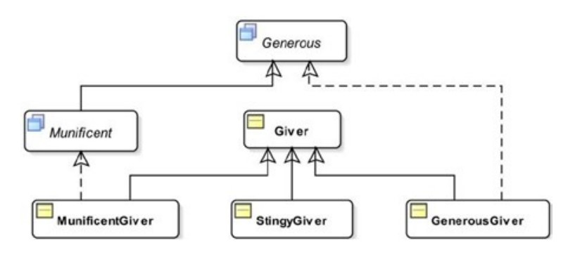

# interface part-5

> CODES ARE IN `partFive` PACKAGE

## The `instanceof` Operator
- To evaluate if a reference type variable refers to an object of a specific class or class implements a specific interface,
- Structure:
    ```
    <<referenceVariable>> instanceof <<referenceType>>
    ```
- Ex: See `instanceOfTest` in `Test.java`,
  ```
  Giver giver = new Giver();
  if(giver instanceof Object){
      System.out.println("giver is an object"); // executed
  }
  else{
      System.out.println("giver is not an object");
  }
  ```
- If `left-hand` side of `instanceof` operator is `null` or refers to `null`, then it will return `false`,
- So, if `var instanceof XYZ` returns `true`, then,
  - `var` is not `null`,
  - The cast `(XYZ)var` will always succeed, i.e. 
    - Class of `var` variable may be subclass of `XYZ` class. or,
    - Class of `var` variable may implement `XYZ` interface,
    - Above two can be done directly or indirectly,

- Each expression has a compile-time and a runtime type in java,  
- `instanceof` operator performs `compile-time` check as well as `runtime` check,
- At compile-time, it checks if it is possible for its `left-hand` operand to point to an instance of its `right-hand` operand type,
- Ex: See `InstanceOfTest.java`,
  
- For above structure:
  - Ex-1:
    ```
    Munificent john = new MunificentGiver();
    System.out.println(john instanceof Munificent); // true
    ```
    - Because `MunificentGiver` implements `Munificent` interface,
  - Ex-2:
    ```
    Giver giver = new Giver();
    System.out.println (giver instanceof Munificent); // false
    ```
    - Because `Giver` class doesn't implement `Munificent` interface,
  - Ex-3:
    ```
    Giver kim = new StingyGiver();
    System.out.println(kim instanceof Munificent); // false
    ```
    - Because `StingyGiver` & `Giver`(parent of `StingyGiver`) class doesn't implement `Munificent` interface,
  - Ex-4:
    ```
    StingyGiver jim = new StingyGiver();
    //System.out.println(jim instanceof Munificent);
    ```
    - `compile-time` error. Because
    - Right side(`Munificent`) is not assignment compatible to left side(`StingyGiver`),
    - How can the compiler be so sure about this possibility? It is easy,
    - `StingyGiver` class is `final`, which means it cannot be `subclassed`,
    - Variable `jim` whose `compile-time` type is `StingyGiver` can only refer to an object whose class is `StingyGiver`,
    - The compiler also knows that the `StingyGiver` class and none of its ancestor classes implement the `Munificent` interface,
    - With all these reasoning, the compiler determines that you have a logical error in your program & you need to fix it,


## Marker Interfaces
- When an interface has no members (declared or inherited), it is known as a marker interface.
- Also called a `tag-interface`,
- An interface can have members in two ways,
  - by declaring its own members, or 
  - by inheriting members from its superinterfaces,
- Why do we need it?
  - Used to mark a class with a special meaning that can be used in a particular context,
  - Class can be organized based on some category,
- Ex: See `MarkerTest.java`,
  ```
  interface Funny { // marker interface
  }
  
  class Human{
      String name;
      public Human(String name) { this.name = name; }
  }
  
  class Cat implements Funny {
      String name;
      public Cat(String name) { this.name = name; }
  }
  
  class Mouse implements Funny {
      String name;
      public Mouse(String name) { this.name = name; }
  }
  ```
  ```
  private static void countFunny(ArrayList<Object> list){
      int count = 0;
      for (Object fun : list){
          if(fun instanceof Funny) count++;
      }
      System.out.println(count+" are funny");
  }
  ```
  Can be used like this:
  ```
  Human john = new Human("John");
  Cat tom = new Cat("Tom");
  Mouse jerry = new Mouse("Jerry");
  
  ArrayList<Object> list = new ArrayList<>();
  list.add(john);
  list.add(tom);
  list.add(jerry);
  countFunny(list); // 2 are funny
  ```
- Java API has many marker interfaces. Ex: `java.lang.Cloneable`, `java.io.Serializable`, `java.rmi.Remote` etc,
- Let's understand the `Clonable` interface:
  - If your class implements the Cloneable interface,
    - it means that you want to allow cloning of the objects of that class,
    - Since `clone()` method has `protected` access in `Object` class. So 
    - For allow cloning You need to override the `clone()` method in your class,
  - Suppose you have overridden `clone()` method in your class without implementing `Clonable` interface,
    - Still the object of your class cannot be cloned until your class implements the `Cloneable` marker interface,
  - You can see that, implementing `Cloneable` interface associates a meaning to the class that its object can be cloned,
  - When the `clone()` method is invoked, Java performs a check 
    - If the class implements the `Cloneable` interface, then ok,
    - Otherwise, it throws an exception at runtime,


## Functional interface
- Contains only one `abstract` method,
- Ex: `StringListener.java`,
  ```
  public interface StringListener {
      void onDateSet(String date);
  }
  ```
  - Can be used for passing date from a date-picker class to another class,


## Comparing Objects
`java.lang.Comparable` and `java.util.Comparator` are two commonly used interfaces for ordering objects,
### Comparable
- A class implements the `Comparable`, if objects of the class need to be compared for sorting purposes,
- The ordering on the objects of a class imposed by `Comparable` interface is also called the class’s natural ordering,
- Contains an `abstract` `compareTo()` method that takes one parameter,
- The `compareTo()` method 
  - Doesn't handle `null` values,
  - Returns zero(`0`), if the two objects are considered equal,
  - Returns a negative integer(`< 0`), if the object is less than the parameter,
  - Returns a positive integer(`> 0`), if the object is greater than the parameter,
- `Comparable` interface is:
  ```
  public interface Comparable<T> {
     public int compareTo(T o);
  }
  ```
- Ex: See `Student.java`, `Test.java`
  ```
  public class Student implements Comparable<Student>{
      private int roll;
      private String name;
      private String email;
      private double height;
      ...
      @Override
      public int compareTo(Student o) {
          // our own logic
          return roll - o.roll; // sorting based on roll
      }
  }
  ```
  Using like this:
  ```
  private static void comparableTest(){
      // using Bard
      Student student1 = new Student(112, "Rakib Hasan", "rakibhasan@gmail.com", 1.75);
      Student student2 = new Student(23, "Sadia Akter", "sadiaakter@gmail.com", 1.65);
      Student student3 = new Student(34, "Ariful Islam", "arifulislam@gmail.com", 1.80);
      Student student4 = new Student(4, "Tasnim Akhter", "tasnimakhter@gmail.com", 1.55);
      Student student5 = new Student(54, "Rafi Ahmed", "rafi@gmail.com", 1.70);
      Student student6 = new Student(15, "Sumaiya Khatun", "sumaiya@gmail.com", 1.60);
  
      List<Student> students = new ArrayList<>();
      students.add(student1); students.add(student2); students.add(student3);
      students.add(student4); students.add(student5); students.add(student6);
  
      printRolls(students); // Rakib(112) Sadia(23) Ariful(34) Tasnim(4) Rafi(54) Sumaiya(15)
      Collections.sort(students);
      printRolls(students); // Tasnim(4) Sumaiya(15) Sadia(23) Ariful(34) Rafi(54) Rakib(112)
  }
  ```

### Comparator
- Used for specifying an ordering different from the ordering specified by the `Comparable` interface,
- `Comparator` interface is:
  ```
  public interface Comparator<T> {
     int compare(T o1, T o2);
     boolean equals(Object obj);
     // Default and static methods are not shown here
  }
  ```
  - `equals()` method is optional because it is inherited from `Object` class,
  - `compare()` method takes `2` parameters and
    - returns zero(`0`) if equal,
    - returns a negative integer(`< 0`) if `1st` argument is less,
    - returns a positive integer(`> 0`) if `2nd` argument is less,

## Polymorphism—One Object, Many Views

## Dynamic Binding and Interfaces
