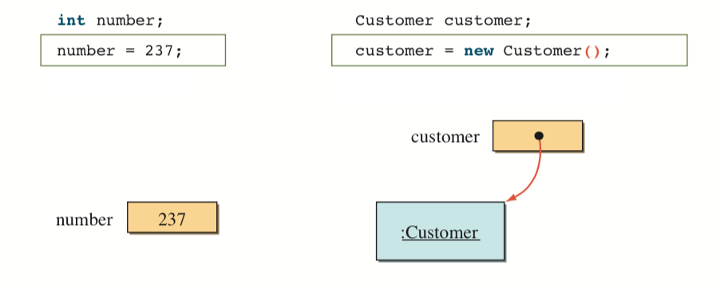
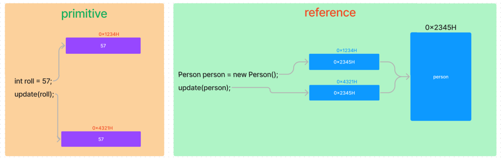

# Classes and Object part-3
> Codes are in `partThree` package

# Parameter passing in java

## Before passing parameter, let us clear these concepts
- Remember, JAVA supports 2 types of data type.
- `primitive`: 
  - `Stores value directly` at its memory address,
- `reference`:
  - `Stores the reference` of the object which is located in `Heap`,
- See this image: `1st` one is `primitive`, `2nd` one is `reference`,


- Every `variable name` has `2` things associated with it: 
  - a memory address(`lvalue`),
  - a value stored at that memory address(`rvalue`),
- For `primitive data type`, memory address hold `actual data`,
- For `reference data type`, memory address hold the `reference of actual data`,
- Ex:
  ```
    Hooman sd = new Hooman("sh",22);
    Hooman sh = new Hooman("sd",23);
    sh = sd; ----(a)
    ```
- `lvalue` stores `rvalue` and here `rvalue` is reference of Hooman object.
- For `(a)`, it is interpreted as
    ```
    lvalue of sh = rvalue of sd
    ```
  it means that memory address of `sh` will store the reference of the object to which `sd` is pointing.

## Back to parameter passing again
- All parameters in Java are `passed by value`,
- No way to pass by reference in JAVA,
- The `memory address with data` is `copied` into different memory address then passed to method,
- For `primitive` data type,
  - Memory address holds `actual value`,
  - So, data is actually copied & it is `truly pass by value`,
- But for `reference` data type,
  - The memory address(`lvalue`) holds the `reference of actual data`, not the actual data,
  - So, `lvalue` with same reference variable is passed,
  - So, `lvalue` is copied but both are pointing to same object,
  - As a result, if we make any change in the object inside method, it will take effect in passed data,
- Ex: See `Student.java` & `Test.java`,
  ```
  public class Student {
      private int roll;
      private String name;
      private int age;
      ...
  }
  ```
  Using like this:
  ```
  public class Test {

      private static void printInfo(Student student){
          System.out.println(student.getRoll()); // 6
          System.out.println(student.getName()); // Hasib
          System.out.println(student.getAge()); // 21
  
          // actual data won't be changed. Remember, lvalue is copied but both point to same object
          student = new Student(18,"Rifat",23); // will make lvalue to point different object. But won't affect actual data
      }
  
      private static void printInfoAdvanced(Student student){
          System.out.println(student.getRoll()); // 12
          System.out.println(student.getName()); // Imran
          System.out.println(student.getAge()); // 21
  
          student.setRoll(24);
          student.setName("Subah");
          student.setAge(21);
          // above 3 lines change the properties of the object to which student is pointing. This is changing the properties of object, so affect actual data
      }
  
      public static void main(String[] args) {
          Student hasib = new Student(6,"Hasib",21);
          printInfo(hasib);
          System.out.println(hasib.getName()); // Hasib
  
          Student imran = new Student(12,"Imran",21);
          printInfoAdvanced(imran);
          System.out.println(imran.getName()); // Subah
      }
      
  }
  ```
- See this image also

