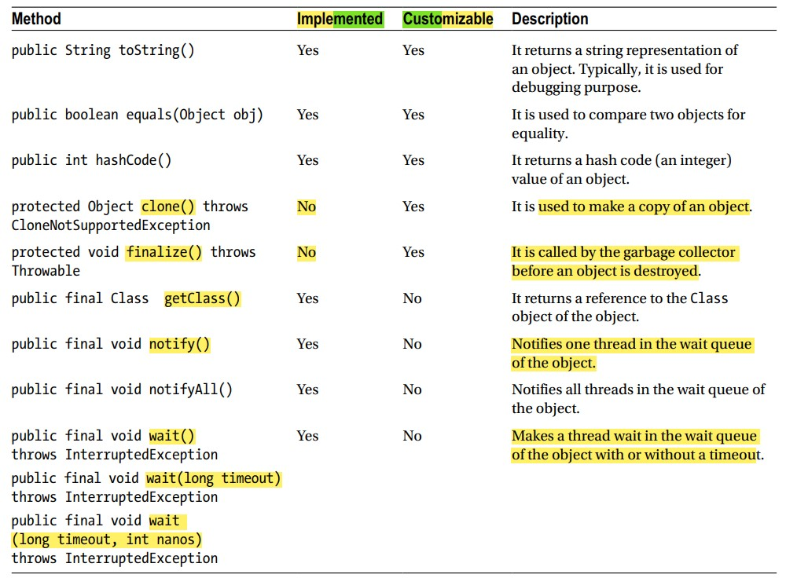

# Object part-1

## Introduction
- Available in `java.lang` package,
- `Superclass` of all classes,
- All java classes extends this `Object` class indirectly,

## 2 important rules of Object class:
- `(Rule-1:)`A variable of `Object` class can hold a reference of an object of any class. Because
  - `Object` class is the superclass of all classes,
  - Since variable of superclass can hold object of its subclasses. So,
  - A variable of `Object` class can hold a reference of an object of any class,
  - Ex: See `Test.java`,
    ```
    private static void ruleTest1(){
    
        Object myObj = new Object();
    
        String name = "hello";
        Object nameObj = name; // ok
    
        Object name2 = "hello"; // ok
        System.out.println(name2); // hello
    
    
        Exception exception = new Exception("anything");
        Object ex = exception; // ok
    }
    ```
- `(Rule-2:)` The Object class has `9` methods, which are available to be used in all classes in Java
  - We can put the methods into two categories:
  - Category - 1:
    - Can't override these methods,
    - Implementation is final,
    - Methods are: 
      - `getClass()`, 
      - `notify()`, 
      - `notifyAll()`, 
      - `wait()`
  - Category - 2:
    - Have a default implementation in the Object class,
    - Can override these methods,
    - Methods are:
      - `toString()`,
      - `equals()`, 
      - `hashCode()`, 
      - `clone()`, 
      - `finalize()`
  - Details of methods
  

  - `Implemented` means method have default implementation,
  - `Customizable` means method can be overridden,

## getClass() method
- Returns the reference of the Class object,
- Ex: See `Test.java`,
  ```
  private static void testGetClass(){
      Cat cat = new Cat("Cat");
      Class<?> catClass = cat.getClass();
  
      System.out.println(catClass); // class g_TheObjectClass.Cat
  
      System.out.println(catClass.getName()); // g_TheObjectClass.Cat
  
      System.out.println(catClass.getSimpleName()); // Cat
  }
  ```

## Hash code
- Learn `Hashing` or ignore it, since it is already implemented & you may never override it, 
- By using an `algo`, form a `piece of info`, an `integer value` is generated(`hashing`),
- Every object has a `hash-value`,
- Used for efficiently retrieving data from hash based collections like `Hashtable`, `HashMap` etc,
- The Object class has a `hashCode()` method that returns an `int`, which is the hash code of the object,
- `hashCode()` is already implemented, but you can override it,(`no need to override`),
- Rules when you override the hashCode() method in your class:
  - Suppose you have `2` variables `x`, `y` referring object of your class,
  - If `x.equals(y)` returns `true`, then
    - Hash of `x` and `y` must be same. i.e.,
    - `x.hashCode() = y.hashCode()`,
  - Opposite of above is not true. i.e. if `x.hashCode() = y.hashCode()` then `x.equals(y)` may not be true,
  - `hashCode()` should generate same value if it is called on same object,
  - Use only those instance variables to compute hash code for an object, which are also used in `equals()` method to check for equality,
- See `hashCode()` of `Student.java`,
  ```
  public class Student {
      private final int roll;
      private final String name;
      private int age;
      private double height;
  
      ...
  
      @Override
      public int hashCode() {
  //        return super.hashCode(); // default implementation
          int hash = 37;
  
          int code = roll;
          hash += 17 * hash + code;
  
          code = (name == null ? 0 : name.length());
          hash += 17 * hash + code;
  
          code = age;
          hash += 17 * hash + code;
  
          code = (int)height;
          hash += 17 * hash + code;
  
          return hash;
      }
      ...
  }
  ```
  Using like this. See `hashTest()` of `Test.java`,
  ```
  private static void hashTest(){
  
      Student saeed = new Student(57,"Saeed",21,170);
      Student jakaria = new Student(56,"Jakaria",22,171);
      Student saeedAgain = new Student(57,"Saeed",21,170);
  
      System.out.println(saeed.hashCode()); // 4218704
      System.out.println(jakaria.hashCode()); // 4213539
      System.out.println(saeedAgain.hashCode()); // 4218704
  }
  ```


## Comparing Objects for Equality
- All objects have a unique identity,
- The memory address at which an object is allocated can be treated as its identity,
- Ex: See `Student.java`,
  ```
  public class Student {
      private final int roll;
      private final String name;
      private int age;
      private double height;
      ...
      @Override
      public int hashCode() { ... }
      
      @Override
      public boolean equals(Object obj) {
          //return super.equals(obj); // default implementation
  
          if(this == obj){ // same reference
              return true;
          }
  
          if(!(obj instanceof Student)) { // object of different classes
              return false;
          }
          
          if(hashCode() != obj.hashCode()){ // different hashCode, so can't be same
              return false;
          }
          
          Student item = (Student)obj;
  
          return roll == item.roll && name.equals(item.name) && age == item.age && height == item.height;
      }
  
  }
  ```
  Using like this. See `equalsTest()` of `Test.java`,
  ```
  private static void equalsTest(){
  
      Student saeed = new Student(57,"Saeed",21,170);
      Student jakaria = new Student(56,"Jakaria",22,171);
      Student saeedAgain = new Student(57,"Saeed",21,170);
  
      Cat cat = new Cat("Happy");
  
      System.out.println(jakaria.equals(jakaria)); // same reference - true
  
      System.out.println(cat.equals(saeed)); // object of different classes - false
      System.out.println(saeed.equals(jakaria)); // different hashCode - false
  
      System.out.println(saeed.equals(saeedAgain)); // fine - true
  }
  ```

## String Representation of an Object
- The string representation of an object,
- Contain enough information about the state of the object,
- Used for debugging purpose(Advanced debugging tools are available though),
- Has a default implementation, but not much useful,
  - Ex: See `defaultEqualsTo()` of `Test.java`,
    ```
    private static void defaultEqualsTo(){
        Cat cat = new Cat("Happy 3X");

        System.out.println(cat.toString()); // g_TheObjectClass.Cat@4dd8dc3
        System.out.println(cat); // g_TheObjectClass.Cat@4dd8dc3

        //above two statements are equivalent
    }
    ```
- Let's override according to our need,
- Ex(custom implementation): See `Student.java`,
  ```
  public class Student {
      private final int roll;
      private final String name;
      private int age;
      private double height;
      ...
  
      @Override
      public String toString() {
          //return super.toString(); // default
          return "roll: " + roll + ", " + "name: " + name + ", " + "age: " + age + ", " + "height: " + height;
      }
  }
  ```
  Using like this: See `customEqualsTo()` of `Test.java`,
  ```
  private static void customEqualsTo() {
  
      Student atik = new Student(38,"Atik",22,168);
      System.out.println(atik.toString()); // roll: 38, name: Atik, age: 22, height: 168.0
  
  
      Student galib = new Student(35,"Galib",22,-173);
  
      int heightInFeet = (int)(galib.getHeight() / 39);
      System.out.println(heightInFeet); // negative so, must have some problem with value
  
      //finding that problem
      System.out.println(galib.toString()); // roll: 35, name: Galib, age: 22, height: -173.0
  
      galib.setHeight(173); // fixing
  
      heightInFeet = (int)(galib.getHeight() / 39);
      System.out.println(heightInFeet); // fine
  }
  ```
  
