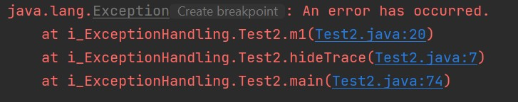
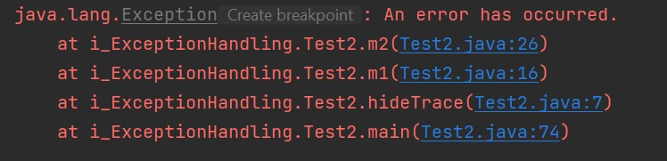

# Exception part-2

## Rethrowing an Exception
- Can be rethrown i.e. can be thrown from `catch` block,
- Can be used for
  - Propagating exception to calling method,
  - Wrapping exception into another exception,
  - Hiding exception details from client,
- Structure:
    ```
    try {
     ...
    }
    catch(MyException e) {
     throw e; // Rethrowing the same exception
    }
    ```
- Rethrown exceptions must be caught from another outer `try-catch` block,
- Ex: (see `Test2.java`)
  ```
  private static void rethrowException(int y){
      try{
          ...
      }catch (Exception e){
          throw new RuntimeException("Can't divide by zero");
      }
  }
  ```
  When calling
  ```
  try {
      rethrowException(0);
  }catch (Exception e){
      e.printStackTrace(); // executed
  }
  ```
- It can also be handled like this:
  ```
  try { // outer, will catch rethrown exception
      try { // innner
          ...
      } catch (Exception e) {
          throw new RuntimeException("Can't divide by zero too");
      }
  }catch (Exception e){
      e.printStackTrace(); // executed
  }
  ```
- Location of exception can also be hidden by using `fillInStackTrace()` method,
- Ex: see `Test2.java`:
  ```
  public static void hideTrace() {
      try {
          m1();
      }
      catch(Exception e) {
          e.printStackTrace(); // hidden original trace
      }
  }
  ```
  ```  
  public static void m1() throws Exception {
      try {
          m2();
      }
      catch(Exception e) {
          e.fillInStackTrace(); // hide trace here -----(a)
          throw e; // rethrowing
      }
  }
  ```
  ```
  public static void m2() throws Exception {
      throw new Exception("An error has occurred."); // just throw
  }
  ```
  - Stack trace with `(a)`:
    - 
  - Stack trace without `(a)`:
  - 
  - Practice yourself to understand clearly,
  

## Throwing too Many Exceptions
- Can be thrown as many as exception you want,
- Ex:
  ```
  private static void throwMultiple(Integer y) throws RuntimeException{
      if(y == null) throw new NullPointerException("Can't be null");
  
      if(y == 0) throw new ArithmeticException("Can't be zero");
  
      System.out.println("ok");
  }
  ```


## Accessing the Stack of a Thread

## The try-with-resources Block
