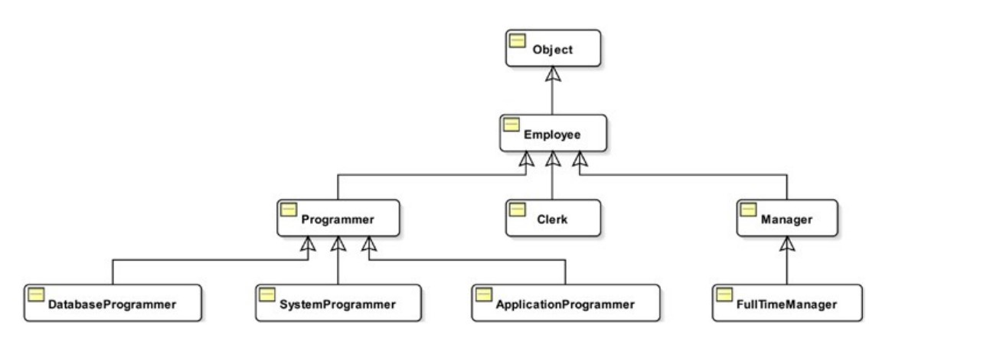
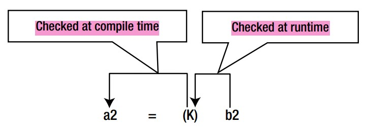

# inheritance part-1

> Codes are in `partOne` package


## Introduction
- Important concept of OOP,
- Lets you create `new-class` by reusing code from `existing-class`,
- `new-class` is called `sub-class`, `child-lass`, `derived-class`,
- `existing-class` is called `super-class` or `parent-class`,
- For example: `PartTimeStudent` can inherit `Student`,
- `is-a` relationship must exist among child and parent class. Ex:
  - `PartTimeStudent` is a `Student`,
  - `Manager` is an `Employee`,
  - `Human` is a `Creature`
- Done using `extends` keyword,
    ```
    public class Child extends Parent{
    ```

## Object Class is the Default Superclass
- `extends Object` is implicitly added for `first` `Parent` class,
- Any class can access code of `Object` class without extending it since it is implicitly extended to `Object` class,
- Ex:
    ```
    class A{ } // A extends Object class implicitly
    class B extends Object{} // explicitly
    ```
  Using like this: See `testForefatherObject()` in `Common.java`
    ```
    private static void testForefatherObject(){
        A a = new A();
        B b = new B();
    
        // hashCode() is defined in Object class
        System.out.println(a.hashCode()); // executed successfully
        System.out.println(b.hashCode()); // executed successfully
    }
    ```

## Inheritance and Hierarchical Relationship
- `is-a` relationship must exist in inheritance,
- All classes in an inheritance chain form a tree-like structure, which is known as an `inheritance-hierarchy` or a `class-hierarchy`,
- All classes in Java have a `superclass` except the `Object` class,
- Example inheritance hierarchy:
  

- `Object` class is the `ancestor` implicitly,
- From above hierarchy,
  - `FullTimeManager` is an `Employee`,
  - `Programmar` is an `Employee`,
  - `Programmar` is an `Object` etc.


## Things Inherited by a Subclass
- A subclass `doesn't` inherit everything from its superclass. But,
- A subclass may use, directly or indirectly, everything from its superclass,
- A subclass inherits `non-private members`(`protected`, package-level and `public`) of its superclass,
  - `public`: always inherited,
  - `protected`: inherited no matter it is in same package or not,
  - package-level: inherited only if `subclass` & `superclass` is in same package,

- `Constructors` and `initializers` aren't members of a class, they are not inherited,
- Members of a class are 
  - All members that are declared inside the body of the class & 
  - Members that it inherits from the superclass,
  
## Upcasting and Down-casting
- `subclass` can always be cast into `superclass`(`upcasting`),
- `super-class` can be cast into `subclass` iff the variable of `superclass` refers object of the `subclass`(`downcasting`),
- Ex:
    ```
    private static void testUpDownCasting(){
        Employee abulKalam = new Employee(1, "Abul Kalam", 50000);
    
        Employee employee = new Manager(2,"Employee",20034,10000);
    
        Manager atikurRahman = new Manager(1, "Atikur Rahman", 80000, 10000);
    
        Employee emp;
        emp = atikurRahman; // upCasting
    
        Manager manager;
        //manager = abulKalam; // compile error
        //manager = employee; // compile error
    
        //manager = (Manager)abulKalam; // runtime error <-------(a)
    
        manager = (Manager) employee; // fine - Down-casting <----(b)
    
    }
    ```
- While `down-casting`, 
  - Make sure the variable(`employee`) is holding the object of the class(`Manager`) to which(`Manager`) you are going to cast,
    
  
  - In `(a)`, `runtime-error` is thrown. Because,
    - `compile-time` check is passed,
    - Failed at runtime check,
    - See above image


## The `instanceof` Operator
- Can be used for making sure that `downcast` will succeed,
- An object is considered an instance of a class if 
  - That object is of that class type, or 
  - its direct or indirect descendant type, 
- You can use the `instanceof` operator to check if an object is an instance of a class or not,
- It performs both `compile-time` and `runtime` check,
- See <a href="https://github.com/abusaeed2433/JavaBasic/blob/66e6efc7f943f2414b38900a9303db3a12894e9b/src/q_Interfaces/info5.md#the-instanceof-operator">instanceof at interface</a> for more,
- Ex: See `instanceofTest()` in `Test.java`,
  ```
  static private void instanceOfTest(){
      Employee abulKalam = new Employee(1, "Abul Kalam", 50000);
      Employee employee = new Manager(2,"Employee",20034,10000);
  
      Manager manager;
  
      if(employee instanceof Manager){
          manager = (Manager) employee; // executed
      }
      else{
          System.out.println("Can't down-cast");
      }
  
      if(abulKalam instanceof Manager){
          manager = (Manager)abulKalam;
      }
      else{
          System.out.println("Can't down-cast"); // executed
      }
  }
  ```
