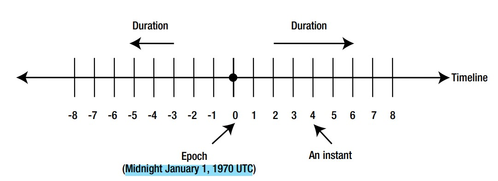
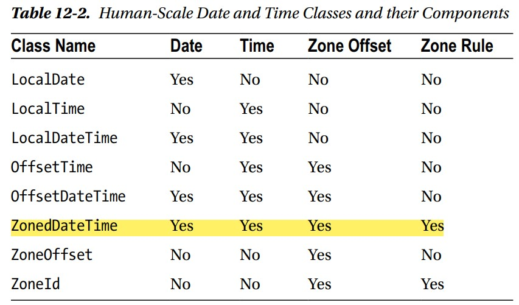

# DateTime part-2

> Codes are in `partTwo` package


## Instants and Durations


- `Epoch` is the reference point. which is `Midnight January 1, 1970 UTC`,
- An `Instant` is a specific point,
- `Duration` is range from `epoch`,
- `nanosecond` precision is available,
- `.toString()`:
  - Returns `yyyy-MM-ddTHH:mm:ss.SSSSSSSSSZ` for `Instant`,
  - Returns `PTnHnMnS` for `Duration`,
- Used for recording `timestamps` and `elapsed time` `between two events`,
- Can be compared to check which one is earlier,
- Classes in the Date-Time API are `Serializable`,
- Ex(`Instant`):
  ```
  Instant instant = Instant.now();
  Instant instant1 = Instant.ofEpochSecond(86420); //second
  
  //----------------------epoch is 1970-01-01T00:00:00Z
  System.out.println(instant1); // 1970-01-02T00:00:20Z
  
  System.out.println( instant1.getEpochSecond() ); // 86420
  System.out.println( instant1.get(ChronoField.MILLI_OF_SECOND) ); // 0
  ```
- Ex(`Duration`):
  ```
  Duration duration = Duration.ofSeconds(86400);
  System.out.println(duration); // PT24H   < ------ 24hours
  
  Duration duration1 = Duration.ofDays(10).plusHours(12).plusMinutes(24).plusSeconds(48);
  System.out.println(duration1); // PT252H24M48S <-- 252hours 24min 48sec
  
  System.out.println( duration1.getSeconds() ); // 908688
  System.out.println( duration1.get(ChronoUnit.NANOS) ); // 0
  ```
- Ex(compare):
  ```
  Instant instant = Instant.ofEpochSecond(86420);
  Instant instant1 = Instant.ofEpochSecond(86420*2);
  
  System.out.println( instant.isBefore(instant1) ); // true
  System.out.println( instant.isAfter(instant1) ); // false
  
  Instant instant2 = Instant.ofEpochSecond(86420);
  System.out.println( instant.equals(instant2) ); // true
  
  Duration duration = Duration.ofSeconds(100);
  Instant instant3 = instant2.plus(duration);
  System.out.println(instant3); // 1970-01-02T00:02:00Z
  
  
  Duration duration1 = Duration.ofDays(120);
  Duration duration2 = duration1.plusDays(120);
  System.out.println(duration2); // PT5760H
  ```

## The `ZoneOffset` Class
- Represents a `fixed zone offset` from `UTC` time zone,
- `ISO-8601 standards` support zone offsets between `-12:00 to +14:00`. But, 
- To avoid any problems in future if the zone offset gets extended, the `Date-Time API` supports zone offsets between `-18:00 to +18:00`,
- Ex:
  ```
  ZonedDateTime zdt = ZonedDateTime.now(ZoneId.of("Asia/Dhaka"));
  ZoneOffset zoneOffset = ZoneOffset.from(zdt);
  System.out.println(zoneOffset); // +06:00
  
  System.out.println(ZoneOffset.UTC); // Z
  System.out.println(ZoneOffset.MIN); // -18:00
  System.out.println(ZoneOffset.MAX); // +18:00
  ```

## The `ZoneId` Class
- Represents a combination of a `zone offset` and the `rules for changing the zone offset`,
- `ZoneId = ZoneOffset + ZoneRules`,
- A time zone has a unique textual ID, which can be specified in `three formats`:
  - `(1st)`Specified in terms of `zone offset`. It can be 
    - `Z` (`UTC 0`),
    - `+hh:mm:ss`,
    - `-hh:mm:ss`,
    - For example: `+06:00`,
  - `(2nd)`Zone ID is prefixed with `UTC`, `GMT`, or `UT` and followed by a `zone offset`,
    - For example: `UTC+06:00`,
  - `(3rd)`Zone ID is specified by using a `region`, 
    - For example, `Asia/Dhaka`,
- Ex:
  ```
  ZoneId zoneId = ZoneId.of("+06:00");
  System.out.println(zoneId); // +06:00
  ZonedDateTime zonedDateTime = ZonedDateTime.now(zoneId);
  System.out.println(zonedDateTime); // 2023-08-17T11:44:59.644430500+06:00 <---- See +06:00
  
  ZoneId zoneId1 = ZoneId.of("UTC+06:00");
  System.out.println(zoneId1); // UTC+06:00
  ZonedDateTime zonedDateTime1 = ZonedDateTime.now(zoneId1);
  System.out.println(zonedDateTime1); // 2023-08-17T11:46:04.027586300+06:00[UTC+06:00] <---- See +06:00
  
  ZoneId zoneId2 = ZoneId.of("Asia/Dhaka");
  System.out.println(zoneId2); // Asia/Dhaka
  ZonedDateTime zonedDateTime2 = ZonedDateTime.now(zoneId2);
  System.out.println(zonedDateTime2); // 2023-08-17T11:46:04.027586300+06:00[Asia/Dhaka] <---- See +06:00
  ```

## Human scale date time components


