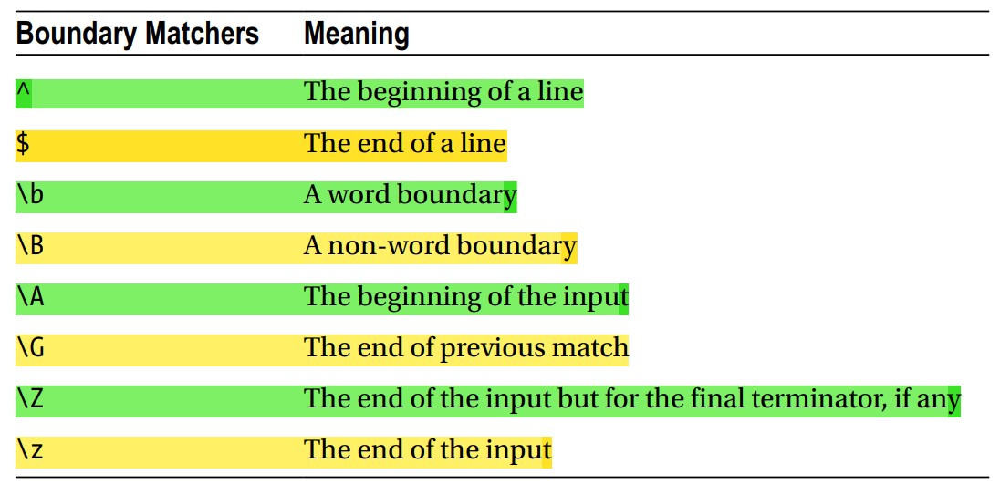

# Regex part-2

> Codes are in `partTwo` package

## Beware of Backslashes
- `\w` means word character,
- `Backslash` is also used as a part of an escape character,
- Can be used to nullify the special meaning of `metacharacters`,
  - Ex: `\[[0-9]\]`
    - Will match `[` then `any digit` then `]`,
    - Will match `[4]`, `[2]` etc,
    - For expressing it, you need to use two `backslashes`,
    - Regex for above will `\\[[0-9]\\]]`,
- Ex: See `backslashTest()` in `Test.java`,
  ```
  private static void backslashTest(){
  
      //String regex = "\\[[0-9]\\]"; // valid
      String regex = "\\[[0-9]]"; // both are valid. ] itself don't have special meaning. So backslashes is optional
  
      Pattern pattern = Pattern.compile(regex);
  
      String[] arr = {"[0]","[1","[s]","2]","[5]"};
  
      for (String str : arr){
          Matcher matcher = pattern.matcher(str);
          if(matcher.find()){
              System.out.println(str+" -> passed");
          }
          else {
              System.out.println(str+" -> failed");
          }
      }
  
  }
  ```
  Output
  ```
  [0] -> passed
  [1 -> failed
  [s] -> failed
  2] -> failed
  [5] -> passed
  [O] -> failed. This capital 'O', not zero
  ```


## Quantifiers in Regular Expressions
- We can specify `number of times` a character appear,
- These are the quantifiers
  <table>
  <tr> <th>Quantifiers</th> <th>Meaning</th> </tr>
  <tr> <th>*</th> <th>Zero or more times</th> </tr>
  <tr> <th>+</th> <th>One or more times</th> </tr>
  <tr> <th>?</th> <th>Once or not at all</th> </tr>

  <tr> <th>{m}</th> <th>Exactly m times</th> </tr>
  <tr> <th>{m, }</th> <th>At least m times</th> </tr>
  <tr> <th>{m, n}</th> <th>At least m, but not more than n times</th> </tr>
  </table>
- `quantifiers` must follow a `character` or `character class` for which it specifies the quantity. Ex: `\d+`,
- Ex-1: See `quantifierTest1()` in `Test.java`,
  - Will match word of the format `fName lName`. where, 
  - `fName` is at least `3` letter, and 
  - `lName` is `5 to 10` letters
  ```
  private static void quantityTest(){
      String regex = "[a-zA-Z]{3,} [A-Za-z]{5,10}";
      Pattern pattern = Pattern.compile(regex);
  
      String[] arr = { "Ibne Sina", "Shujoy Kundu",
              "Hasib Hasan Hasib Hasan",
              "Mahir Abrar", "gd n8"
      };
  
      for(String name : arr){
          Matcher matcher = pattern.matcher(name);
          if(matcher.matches()){
              System.out.println(name+" -> passed");
          }
          else{
              System.out.println(name+" -> failed");
          }
      }
  }
  ```
  Output:
  ```
  Ibne Sina -> failed
  Shujoy Kundu -> passed
  Hasib Hasan Hasib Hasan -> failed
  Mahir Abrar -> passed
  gd n8 -> failed
  ```
- Ex-2: See `quantifierTest2()` in `Test.java`,
- Will match word
  - consists of `small letter` and
  - contain small `s` only one or not at all
  ```
  private static void quantityTest2(){
      String regex = "[a-rt-z]*s?[a-rt-z]*";
      Pattern pattern = Pattern.compile(regex);
  
      String[] arr = {"amskn","sssla","substr","ms","s"};
  
      for(String str : arr){
          Matcher matcher = pattern.matcher(str);
  
          if(matcher.matches()){
              System.out.println(str+" -> passed");
          }
          else{
              System.out.println(str+" -> failed");
          }
  
      }
  }
  ```
  Output:
  ```
  amskn -> passed
  sssla -> failed
  substr -> failed
  ms -> passed
  s -> passed
  ```


## Matching Boundaries
- Finding location of match,
- Ex: Replacing `apple` with `orange`:
  ```
  I have an apple and five pineapples // input 
  I have an orange and five pineapples // replaced
  ```
- Boundary matchers in java:
  
- Remember, A word character is defined by `[a-zA-Z_0-9]`,
- `A word boundary` is a `zero-width match` that matches the following:
  - Between a `word character` and a `non-word character`,
  - `Start of the string` and a `word character`,
  - A `word character` and the `end of the string`,
- Similarly, a `non-word boundary` matches the following:
  - The `empty string`,
  - Between two word characters,
  - Between two non-word characters,
  - Between a non-word character and the start,
  - Between a non-word character and end of the string,
- For matching `apple` in earlier sentence regex should be `\bapple\b`,
- Ex-1: See `boundaryMatcher1()` in `Test.java`,
  ```
  private static void boundaryMatcher1(){
      String input = "I have an apple and five pineapples";
  
      String regex = "\\bapple\\b"; // Use \\b to get \b inside the string literal
      String replacedWith = "orange";
  
      String output = input.replaceAll(regex,replacedWith);
      System.out.println(output); // I have an orange and five pineapples
  }
  ```
- Ex-2: See `boundaryMatcher1Manually()` in `Test.java`,
  ```
  private static void boundaryMatcher1Manually(){
      String input = "apple, I have an apple, and five pineapples & two more apple";
  
      String regex = "\\bapple\\b";
      Pattern pattern = Pattern.compile(regex);
      Matcher matcher = pattern.matcher(input);

      while (matcher.find()){
          System.out.println(matcher.group()+" from "+matcher.start()+" to "+matcher.end());
      }  
  }
  ```
  Output:
  ```
  apple from 0 to 5
  apple from 17 to 22
  apple from 55 to 60
  ```
