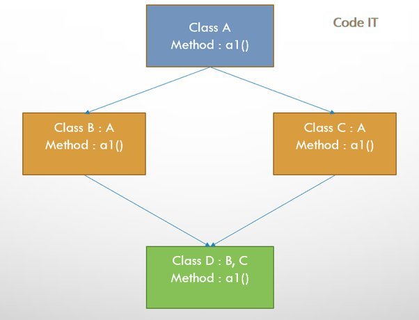

# inheritance part-7
> Codes are in `partSeven` package

## No Multiple Inheritance of Classes
- Is defined as having a class inherit from more than one superclass,
- Java **doesn't support** multiple inheritance of class,
- There is no `Diamod-problem`,
  - Diamond problem
    -  
    - Occurs when same method(`a1()`) is available in more than one parent class(`B`, `C`),
    - So, after inheriting, compiler will be confused which one to call,
- Java don't have such problem,

## inheritance summary
- ### inheritance:
  - Promotes code `reuse`,
  - lets you write code in terms of a class that works for the class and all its `subclasses`,
  - The `subclass` inherits `members` of its `superclass` based on some rules,
  - `Constructors` aren't inherited by `subclasses`,
  - If a class declaration does not contain the keyword `extends`, the class implicitly inherits the `Object` class,
  - A subclass may access the `constructors`, `methods`, and `fields` of its `superclass` using the keyword `super`,
  - The call to access the `constructor` of the `superclass` must be the `first` statement in the `constructor` of the `subclass`,
- ### Early binding:
  - Compiler determines `fields` and `methods` to be accessed, based on the `compile-time` type,
  - Used for accessing all types of `fields` and `static methods`,
- ### Late binding:
  - `Runtime-type` of the reference variable determines the `method` that is executed,
  - Used for accessing `instance methods`,
- ### upcasting:
  - variable of a `superclass` can always hold a reference of its `subclasses`,
- ### down-casting:
  - A variable of a `subclass` is type cast and assigned to a variable of the `superclass`,
  - For a `downcasting` to succeed at runtime, the variable of the `superclass` must contain a reference of 
    - The `subclass`, or 
    - The `subclasses` of the `subclass`,
- ### `instanceof`:
  - Used to test whether a reference variable is an `object` of a specific class,
- ### Abstract class:
  - Can't be `instantiated`,
  - Can be declared `abstract` even if it contains no `abstract-methods`,
  - `Abstract methods` are supposed to be `overridden` and provided an implementation by `subclasses`,
- ### method hiding:
  - Redefining the `static methods` of a `superclass` inside a `subclass`,
  - `Hidden methods` may be accessed from the `subclass` using the `superclass class name` as the qualifier for the method.
- ### field hiding:
  - A `field` with the `same name` hides the `field` in the `superclass`,
  - `Hidden field` may be accessed by using the keyword `super`,
- ### final class & method:
  - `Classes` and `methods` may be declared `final`,
  - A `final` `class` & `method` can't be `inherited`,

    

>> There are two ways to write error-free programs; only the third one works. (Alan J. Perlis)

