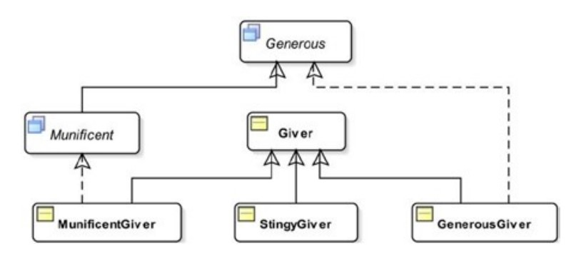

# interface part-5

> CODES ARE IN `partFive` PACKAGE

## The `instanceof` Operator
- To evaluate if a reference type variable refers to an object of a specific class or class implements a specific interface,
- Structure:
    ```
    <<referenceVariable>> instanceof <<referenceType>>
    ```
- Ex: See `instanceOfTest` in `Test.java`,
  ```
  Giver giver = new Giver();
  if(giver instanceof Object){
      System.out.println("giver is an object"); // executed
  }
  else{
      System.out.println("giver is not an object");
  }
  ```
- If `left-hand` side of `instanceof` operator is `null` or refers to `null`, then it will return `false`,
- So, if `var instanceof XYZ` returns `true`, then,
  - `var` is not `null`,
  - The cast `(XYZ)var` will always succeed, i.e. 
    - Class of `var` variable may be subclass of `XYZ` class. or,
    - Class of `var` variable may implement `XYZ` interface,
    - Above two can be done directly or indirectly,

- Each expression has a compile-time and a runtime type in java,  
- `instanceof` operator performs `compile-time` check as well as `runtime` check,
- At compile-time, it checks if it is possible for its `left-hand` operand to point to an instance of its `right-hand` operand type,
- Ex: See `InstanceOfTest.java`,
  
- For above structure:
  - Ex-1:
    ```
    Munificent john = new MunificentGiver();
    System.out.println(john instanceof Munificent); // true
    ```
    - Because `MunificentGiver` implements `Munificent` interface,
  - Ex-2:
  ```
    Giver giver = new Giver();
    System.out.println (giver instanceof Munificent); // false
    ```
    ```
    Giver kim = new StingyGiver();
    System.out.println(kim instanceof Munificent); // false
    ```
    ```
    StingyGiver jim = new StingyGiver();
    //System.out.println(jim instanceof Munificent);
    ```

## Marker Interfaces

## Comparing Objects

## Polymorphism—One Object, Many Views

## Dynamic Binding and Interfaces
