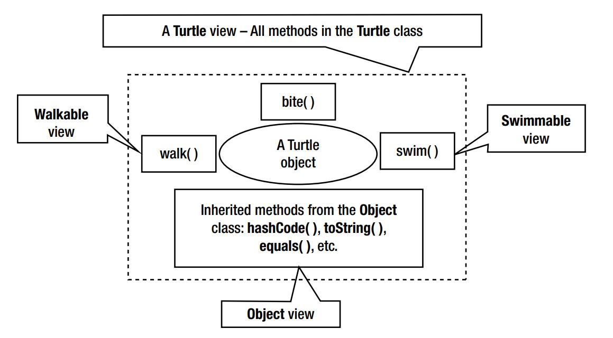

# interface part-6

> CODES ARE IN `partSix` PACKAGE

## Polymorphism - One Object, Many Views
- It is an ability of an object to provide its different views,
- Interfaces let you create a polymorphic object,
- Ex: See `Walkable.java`, `Swimmable.java`, `Turtle.java`, & `Test.java`,
    ```
    public interface Walkable {
        void walk();
    }
    ```
    ```
    public interface Swimmable {
        void swim();
    }
    ```
    ```
    public class Turtle implements Walkable,Swimmable{
        private String name;
        ...
  
        public void bite(){
            System.out.println(name+" is biting...");
        }
        @Override
        public void swim() {
            System.out.println(name+" is swimming...");
        }
        @Override
        public void walk() {
            System.out.println(name+" is walking...");
        }
    }
    ```
    ```
    private static void testPolymorphic(){
        Turtle turti = new Turtle("Turti");
    
        Swimmable swimmable = turti;
        Walkable walkable = turti;
        Object obj = turti;
    }
    ```
  - `4` different views of the same `turti` object is shown in above `testPolymorphic` method. See below image:
  
  - If we use `Walkable` view, then we can access `walk()` method on `Turtle` object,
  - So, different views give different types of access to an object,

- An object of a class can have the following views:
  - A view that is **defined by its class** type
  - Views that are **defined by all superclasses** (direct or indirect) of its class,
  - Views that are **defined by all interfaces implements** by its class or superclasses(direct or indirect),  
- In previous example `Turtle` class has `4` views:
  - `1` from it own class,
  - `1` from its superclass `Object`. Remember, `Object` class is superclass of all class,
  - `2` from implementing two interfaces,
- It may be useful if we want to give access to some particular method of a class,
- One simple example: See `Test.java`,
  ```
  private static void startWalking(Walkable walkable){
      walkable.walk(); // Can't access other method
      ...
  }
  ```
  Calling like this
  ```
  Turtle turti = new Turtle("Turti");
  startWalking(turti); // Turti is walking...
  ```

## Dynamic Binding and Interfaces
- Java uses `dynamic-binding`when a method is invoked using a variable of an interface type,
- See this example:
  ```
  Walkable oogway = new Turtle("Oogway");
  oogway.walk();
  ```
  - The variable `oogway` has two types:
    - a `compile-time` type which is `Walkable`,
    - a `runtime-type` which is `Turtle`,
  - While compiling `oogway.walk()`, 
    - The compiler verifies that the call is valid according to compile-type,
  - While executing `oogway.walk()`, the runtime decides the implementation of the `walk()` method to invoke as follows:
    - Gets info about the class of the object to which `oogway` is referring. Here it is `Turtle`,
    - Then it looks for `walk()` method in that class. If not found, it will keep looking its ancestor class,
    - If still not found, then it searches in all `super-interfaces` implemented by classes that were searched earlier. Now,
      - If one specific `default` method is found, then execute it,
      - If multiple `default` methods are found, then `IncompatibleClassChangeError` is thrown,
      - If an abstract method is found, an `AbstractMethodError` is thrown,
    - If still not found, then `NoSuchMethodError` is thrown,


>> If, at first, you do not succeed, call it version 1.0. ― Khayri R.R. Woulfe

