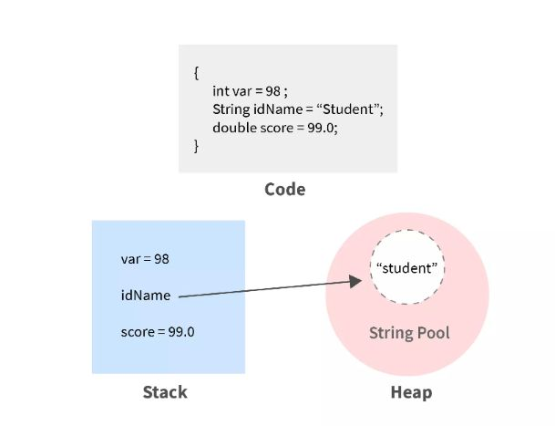

### Java Stack Memory vs Heap Memory

#### Stack Memory 
- Holds the values of the primitive type variables. (int, float, double, char, boolean, etc.),
- Reference variables are stored in the Stack.
#### Heap Memory 
- Stores the non-primitive objects,
- String Constant Pool also resides in the Heap Memory.

<div>

</div>
Image Source: Scalar

### Find output of this program
```
class A{

    public void m1(){
        System.out.println("A.m1()");
    }

    public void m2(){ // <---------------------------
        System.out.println("A.m2()");
    }
}
```
```
class B extends A{

    public void m2(){
        System.out.println("B.m2()");
    }
}
```
```

class OverridingTest{
    public static void main(String[] args) {
        A a = new B();
        a.m1(); // A.m1()
        a.m2(); // B.m2() // <--------------
    }
}
```
- If `class-A` doesn't contain method `m2()`, then compile time error. But if `class-A` contains method `m2()`, then `m2()` of `class-B` will be called. Because variable `a` is referring to object of `class-B`,
- But why:
- **The error occurred because of Java's static type checking,**
- The class of the reference variable determines which instance methods can be called on it and since `class-A` doesn't have method `m2()`, the compiler will complain,
- But when we are adding `m2()` in `class-A`, compiler error will be gone. Now in runtime it will call `m2()` of `class-B` since variable `a` is referring to an object of `class-B` due to polymorphism rule.

## next